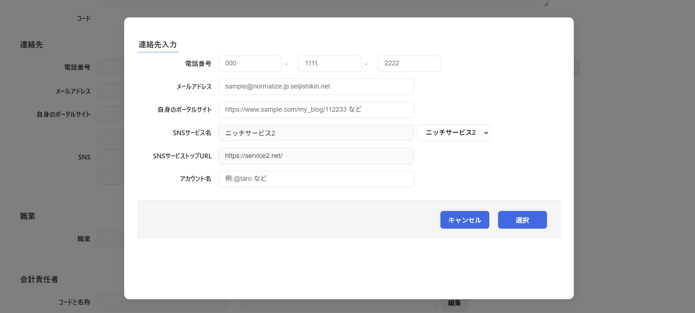

# コンポーネント設計書: InputAccess.vue

## 1. 概要

- 連絡先情報（電話番号、電子メール、代表サイトURL、SNS情報）を入力するフォームです。
- 電話番号は「市外局番」「市内局番」「加入者番号」の3つに分けてテキスト入力します。
- SNSサービス選択肢は、コンポーネントマウント時にAPIから取得します。
- SNSサービス選択肢（セレクトボックス）で既存サービスを選択した場合、対応するサービス情報が自動設定され、SNSサービス名とトップURLの編集はロック（`disabled`）されます。未選択（先頭の選択肢）の場合は、任意の手動入力が可能です。
- 親コンポーネントから渡された初期値を `structuredClone` を用いてディープコピーした内部状態で管理し、直接 Props を編集しない安全なデータバインディングを実現しています。

## 2. 依存子コンポーネント

- なし(メッセージ表示コンポーネントを除く)

## 3. 画面レイアウトイメージ

## 4. インターフェース仕様

### Props

| プロパティ名 |            型             | 必須  |                       説明                       |
| :----------- | :------------------------ | :---: | :----------------------------------------------- |
| `editDto`    | `InputAccessDtoInterface` |  Yes  | 親コンポーネントから渡される初期値オブジェクト。 |

### Emits

|         イベント名         |                引数                |                          説明                          |
| :------------------------- | :--------------------------------- | :----------------------------------------------------- |
| `sendCancelInputAccess`    | なし                               | 編集をキャンセルし、モーダルを閉じるよう親に通知する。 |
| `sendInputAccessInterface` | `sendDto: InputAccessDtoInterface` | 編集結果を親コンポーネントに送信する。                 |

## 5. データ構造 (DTO)

コンポーネント間のデータ受け渡しには `InputAccessDtoInterface` を使用します。

### `InputAccessDtoInterface` 仕様

|   プロパティ名   |    型    |  桁数  |                        説明                         |
| :--------------- | :------- | :----: | :-------------------------------------------------- |
| `phon1`          | `string` |   5    | 電話番号1（市外局番など、プレースホルダー: 000）    |
| `phon2`          | `string` |   5    | 電話番号2（市内局番など、プレースホルダー: 1111）   |
| `phon3`          | `string` |   5    | 電話番号3（加入者番号など、プレースホルダー: 2222） |
| `email`          | `string` |  100   | 電子メールアドレス                                  |
| `myPortalUrl`    | `string` | 制限無 | 自身のポータルサイトURL                             |
| `snsServiceId`   | `number` |   -    | SNSサービスId                                       |
| `snsServiceCode` | `number` |   -    | SNSサービスコード                                   |
| `snsServiceName` | `string` |  100   | SNSサービス名称                                     |
| `snsPortalUrl`   | `string` | 制限無 | SNSサービストップURL                                |
| `snsAccount`     | `string` |  100   | SNSアカウント名                                     |

## 6. 処理ロジック (ライフサイクル & イベントハンドラ)

### 6.1 `onMounted()`

- **契機**：コンポーネントマウント時
- **処理内容**：
  1. タイトル（`title`）に「SNS選択肢取得」を設定する。
  2. [トークン取得共通関数: getAuthorizedPromiseArea()](../../use_api/getAuthorizedPromiseArea.md) を呼び出して認証トークンを取得する。
     - **トークン取得成功時**：
       - バックエンドAPI [sns-service/get-options](../../use_api/snsServiceGetOptions.md) に対してリクエストを送信する。
       - 取得成功時は、レスポンスのJSONデータを `listSnsService.value`（`SnsServiceOptionDtoInterface[]`）に代入する。
       - APIアクセスエラー（catch）時は、メッセージボックスのエラーレベル（`MessageConstants.LEVEL_ERROR`）、表示タイプ（`MessageConstants.VIEW_OK`）、メッセージ（「システム管理者にお問い合わせください」）を設定する。
     - **トークン取得失敗時**：
       - 共通関数よりスローされる各種エラー（`AccessTokenNotFoundError`、`TokenRefreshError`、その他エラー）に応じたエラーメッセージを表示する。詳細なエラー仕様は [トークン取得共通関数: getAuthorizedPromiseArea()](../../use_api/getAuthorizedPromiseArea.md) を参照。

### 6.2 `onSelectSns(event)`

- **契機**：SNSサービス選択肢（セレクトボックス）の変更（`change`）イベント発生時
- **引数**：`event: Event`
- **処理内容**：
  1. イベントの `target.selectedIndex` から選択された要素のインデックスを取得する。
  2. `listSnsService.value` から対応する `selectedDto` を取得する。
  3. `selectedDto` が存在する場合、以下のデータを `inputAccessDto.value` にコピーする。
     - `snsServiceId` ← `selectedDto.value`
     - `snsServiceCode` ← `selectedDto.serviceCode`
     - `snsServiceName` ← `selectedDto.text`
     - `snsPortalUrl` ← `selectedDto.portalUrl`
  4. 選択されたインデックスが `0`（未選択または新規手動入力枠）の場合は `isDisabled.value` を `false`（入力可能）に、それ以外の場合は `true`（入力不可）に設定する。

### 6.3 `onSave()`

- **契機**：「選択」ボタン押下時
- **処理内容**：
  1. `sendInputAccessInterface` イベントを発火し、引数に `inputAccessDto.value` を渡して親コンポーネントに送信する。

### 6.4 `onCancel()`

- **契機**：「キャンセル」ボタン押下時
- **処理内容**：
  1. `sendCancelInputAccess` イベントを発火して親コンポーネントに通知する。
