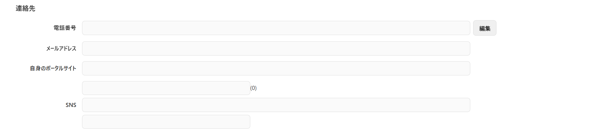

# 親コンポーネント設計書: ViewInputAccess.vue

## 1. 概要

- 連絡先情報（電話番号、電子メール、代表サイトURL、SNS情報）を読取専用フィールドで表示します。
- 「編集」ボタンを押下することで、詳細入力を行うための `InputAccess.vue` をモーダルダイアログとしてオーバーレイ表示します。
- 子コンポーネントからの編集決定・キャンセル通知を受け取り、データ同期およびダイアログの表示制御を行います。

## 2. 依存子コンポーネント

本機能は、呼び出し元画面に配置される「表示用親コンポーネント」と、モーダルダイアログとして動作する「編集用子コンポーネント」の親子構造で構成されています。

| コンポーネントファイル名 |                                                 役割                                                  |        備考        |
| :----------------------- | :---------------------------------------------------------------------------------------------------- | :----------------- |
| `InputAccess.vue`        | 子コンポーネント。電話番号やメールアドレス、SNS情報などを個別にテキスト入力するフォームを提供します。 | モーダル形式で表示 |

## 3. 画面レイアウトイメージ

※ [編集] ボタン押下時、背面を半透明ブラックアウトさせ（`overBackground`）、前面に子コンポーネントをモーダル表示（`overComponent`）します。

## 4. インターフェース仕様

### Props

| プロパティ名 |            型             | 必須  |             説明             |
| :----------- | :------------------------ | :---: | :--------------------------- |
| `editDto`    | `InputAccessDtoInterface` |  Yes  | 編集対象となる連絡先データ。 |

### Emits

なし

## 5. 算出プロパティ (Computed)

### 5.1 `inputAccessDto`

- **処理内容**：Props の `editDto` をそのまま返却する。

### 5.2 `allPhon`

- **処理内容**：`inputAccessDto` の `phon1` + `phon2` + `phon3` をセパレータ（ハイフンなど）なしで結合した文字列を生成する。

## 6. 処理ロジック (イベントハンドラ)

### 6.1 `onInputAccess()`

- **契機**：「編集」ボタン押下時
- **処理内容**：
  1. `isInputAccess.value` を `true` に設定し、編集モーダルを表示する。

### 6.2 `recieveCancelInputAccess()`

- **契機**：子コンポーネントからの `sendCancelInputAccess` イベント検知時
- **処理内容**：
  1. `isInputAccess.value` を `false` に設定し、編集モーダルを非表示にする（変更内容は破棄されます）。

### 6.3 `recieveInputAccessInterface(sendDto)`

- **契機**：子コンポーネントからの `sendInputAccessInterface` イベント検知時
- **引数**：`sendDto: InputAccessDtoInterface` (子コンポーネントで編集されたデータ)
- **処理内容**：
  1. Propsの直接変更を避けるため、引数 `sendDto` の各プロパティを、Props経由の `inputAccessDto.value` の各プロパティへ個別に代入（コピー）する。
     - `phon1` ← `sendDto.phon1`
     - `phon2` ← `sendDto.phon2`
     - `phon3` ← `sendDto.phon3`
     - `email` ← `sendDto.email`
     - `myPortalUrl` ← `sendDto.myPortalUrl`
     - `snsServiceCode` ← `sendDto.snsServiceCode`
     - `snsServiceId` ← `sendDto.snsServiceId`
     - `snsServiceName` ← `sendDto.snsServiceName`
     - `snsPortalUrl` ← `sendDto.snsPortalUrl`
     - `snsAccount` ← `sendDto.snsAccount`
  2. `isInputAccess.value` を `false` に設定し、編集モーダルを非表示にする。
