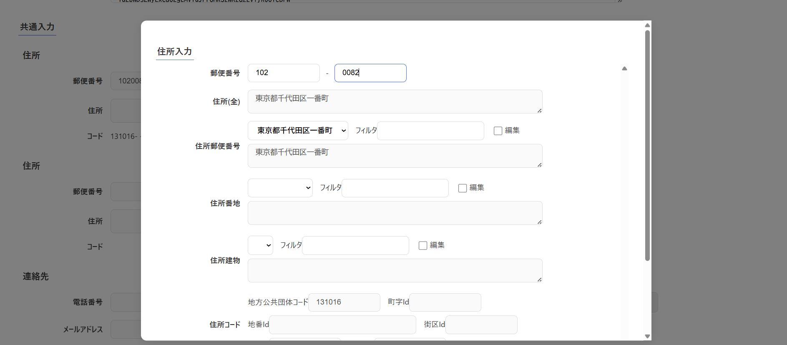

# コンポーネント設計書: InputAddress.vue

## 1. 概要

- 郵便番号の入力と連動し、対応する住所候補（郵便番号まで、番地、建物）のサジェスト・自動補完・手動編集、および対応する詳細な住所コード（地方公共団体コードや各種Id）を自動取得・バインディングするための入力フォームコンポーネントです。
- 郵便番号は「前3桁」「後4桁」に分けて入力します。
- 住所は「郵便番号まで」「番地」「建物」の3段階構成とし、各段階でフィルタ検索が可能なドロップダウン候補（サジェスト）から選択します。
- サジェスト外の住所を直接書き換える場合は、それぞれの段階の「編集」チェックボックスをONにすることでテキストエリアへの手動入力が解禁されます。手動編集をOFFに戻した場合は、直前でドロップダウン選択していた住所に自動リセットされます。
- アドレス・ベース・レジストリ（地方公共団体による住居表示データ等）に基づき、番地や建物が決定した契機に詳細な住所コードが自動的に裏側で特定され、DTOにバインドされます。

## 2. 依存子コンポーネント

- なし(メッセージ表示コンポーネントを除く)

## 3. 画面レイアウトイメージ

## 4. インターフェース仕様

### Props

| プロパティ名 |             型             | 必須  |                       説明                       |
| :----------- | :------------------------- | :---: | :----------------------------------------------- |
| `editDto`    | `InputAddressDtoInterface` |  Yes  | 親コンポーネントから渡される初期値オブジェクト。 |

### Emits

|         イベント名          |                引数                 |                          説明                          |
| :-------------------------- | :---------------------------------- | :----------------------------------------------------- |
| `sendCancelInputAddress`    | なし                                | 編集をキャンセルし、モーダルを閉じるよう親に通知する。 |
| `sendInputAddressInterface` | `sendDto: InputAddressDtoInterface` | 編集・決定した住所情報を親コンポーネントに送信する。   |

## 5. データ構造 (DTO)

コンポーネント間のデータ受け渡しには `InputAddressDtoInterface` を使用します。

### `InputAddressDtoInterface` 仕様

|     プロパティ名      |    型     |  桁数  |                     説明                     |
| :-------------------- | :-------- | :----: | :------------------------------------------- |
| `addressAll`          | `string`  | 制限無 | 住所全体（郵便番号まで + 番地 + 建物）       |
| `orginAddressAll`     | `string`  | 制限無 | 元住所全体（比較・控え用）                   |
| `postalcode1`         | `string`  |   3    | 郵便番号（前3桁）                            |
| `postalcode2`         | `string`  |   4    | 郵便番号（後4桁）                            |
| `addressPostal`       | `string`  |  100   | 住所郵便番号まで                             |
| `addressBlock`        | `string`  |  100   | 住所番地                                     |
| `addressBuilding`     | `string`  |  100   | 住所建物                                     |
| `lgCode`              | `string`  |   6    | 地方公共団体コード                           |
| `machiazaId`          | `string`  |   7    | 町字Id                                       |
| `blkId`               | `string`  |   3    | 街区Id                                       |
| `prcId`               | `string`  |   15   | 地番Id                                       |
| `rsdtId`              | `string`  |   3    | 住居Id                                       |
| `rsdt2Id`             | `string`  |   5    | 住居2Id                                      |
| `isPostalEdit`        | `boolean` |   -    | 住所郵便番号までの手動編集有無フラグ         |
| `isBlockEdit`         | `boolean` |   -    | 住所番地の手動編集有無フラグ                 |
| `isBuildingEdit`      | `boolean` |   -    | 住所建物の手動編集有無フラグ                 |
| `rsdtAddressPostl`    | `string`  | 制限無 | アドレス・ベース・レジストリ住所郵便番号まで |
| `rsdtAddressBlock`    | `string`  | 制限無 | アドレス・ベース・レジストリ住所番地まで     |
| `rsdtAddressBuilding` | `string`  | 制限無 | アドレス・ベース・レジストリ住所建物         |

## 6. 処理ロジック (ライフサイクル & イベントハンドラ)

### 6.1 `getAddressPostal()`

- **契機**：郵便番号（`postalcode1` 又は `postalcode2`）入力時
- **処理内容**：
  1. `postalcode1` が3桁、かつ `postalcode2` が4桁の揃った状態であるかを検証する。
  2. **揃っている場合**：
     - [トークン取得共通関数: getAuthorizedPromiseArea()](../../use_api/getAuthorizedPromiseArea.md) を呼び出して認証トークンを取得する。
     - トークン取得成功時、バックエンドAPI `/postal-search/postal` に対して HTTP POST で、入力された郵便番号（`postal1`, `postal2`）を `PostalCodeCapsuleDto` 形式で送信する。
     - レスポンスのJSON（`PostalCodePostalResultDtoInterface`）から、サジェスト候補リスト `listPostalSuggest.value` をバインドし、行政区データフラグ `isGyouseiku.value` を設定する。
     - サジェスト候補が1件のみだった場合、それを自動選択値とし、直ちに次の段階である `selectSuggestPostal()` を自動実行する。
  3. **揃っていない場合（または削除時）**：
     - 住所・各種コード（`addressPostal`, `addressBlock`, `addressBuilding`, `lgCode`, `blkId`など）をすべて空文字または初期値にリセットする。

### 6.2 `selectSuggestPostal()`

- **契機**：住所郵便番号ドロップダウンの候補選択（`change`）時、または自動決定時
- **処理内容**：
  1. 選択された候補オブジェクトを抽出し、そのテキスト（「以下に掲載がない場合」という文言は削除して置換）を `inputAddressDto.value.addressPostal` に設定する。
  2. 設定後、次の段階の番地検索 `/postal-search/block` へのAPIアクセス（`searchBlock()`）を実行する。
  3. 未選択（初期値など）の場合は、住所郵便番号までをクリアし、番地候補リストをすべてクリアする。

### 6.3 `searchBlock()`

- **契機**：郵便番号決定に基づく自動番地サジェスト取得時
- **処理内容**：
  1. [トークン取得共通関数: getAuthorizedPromiseArea()](../../use_api/getAuthorizedPromiseArea.md) からトークンを取得し、バックエンドAPI `/postal-search/block` に対して HTTP POST で選択済み郵便番号情報を送信する。
  2. レスポンス（`PostalCodeBlockResultDtoInterface`）から、番地サジェスト候補リスト `listBlockSuggest.value` にバインドし、同時に `lgCode`（地方公共団体コード）を設定する。
  3. 候補リストが1件のみの場合：
     - 特殊展開マーク（★）が候補テキストに含まれているかを検証する。含まれている場合は、住所文字列の切り分け・差し戻しなど特殊な郵便番号範囲補正を行い、リストを再構築する。
     - 番地を自動決定し、直ちに `selectSuggestBlock()` を自動実行する。

### 6.4 `selectSuggestBlock()`

- **契機**：住所番地ドロップダウンの候補選択（`change`）時、または自動決定時
- **処理内容**：
  1. 選択された番地情報を `inputAddressDto.value.addressBlock` に設定する。
  2. 設定後、建物名サジェスト検索（`searchBuilding()`）を実行する。
  3. 未選択の場合は、番地情報をクリアし、建物候補リストをクリアする。

### 6.5 `searchBuilding()`

- **契機**：番地決定に基づく自動建物サジェスト取得時
- **処理内容**：
  1. [トークン取得共通関数: getAuthorizedPromiseArea()](../../use_api/getAuthorizedPromiseArea.md) からトークンを取得し、バックエンドAPI `/postal-search/building` に対して HTTP POST で `lgCode`, `selectedBlock`（選択された番地コード）を送信する。
  2. 戻りの候補を建物サジェスト候補リスト `listBuildingSuggest.value` にバインドする。
  3. 建物候補がゼロの場合、あるいは未選択のままの可能性もあるため、常に番地確定段階での最も詳細な住所コード情報を特定・取得するための `/postal-search/rsdt-detail-block` へのAPIアクセス（`getRsdtCodeByBlock()`）を実行する。

### 6.6 `getRsdtCodeByBlock()`

- **契機**：番地確定時における詳細住所コード特定時
- **処理内容**：
  1. バックエンドAPI `/postal-search/rsdt-detail-block` に対し、`lgCode` と `selectedBlock` を送信する。
  2. 正常にレスポンス（`AddressRsdtResultDtoInterface`）が取得できた場合、その内部エンティティから、詳細住所コード（`blkId`, `machiazaId`, `prcId`, `rsdtId`, `rsdt2Id`）を `inputAddressDto.value` にそれぞれバインドする。
  3. コードが取得できなかった場合は、警告メッセージを表示し、該当コードプロパティを空文字にリセットする。

### 6.7 `selectSuggestBuilding()`

- **契機**：住所建物ドロップダウンの候補選択（`change`）時
- **処理内容**：
  1. 選択された建物名テキストを、`addressBuilding` および `rsdtAddressBuilding` に設定する。
  2. 建物個別の詳細住所コードを取得するため、`/postal-search/rsdt-detail-id` へのAPIアクセス（`getRsdtCodeById()`）を実行する。

### 6.8 `getRsdtCodeById()`

- **契機**：建物確定時における個別住所コード特定時
- **処理内容**：
  1. バックエンドAPI `/postal-search/rsdt-detail-id` に対し、`lgCode` と、選択された建物の識別子 `selectedRsdtId` を送信する。
  2. 正常取得時、該当建物に対応する詳細住所コード（`blkId`, `machiazaId`, `prcId`, `rsdtId`, `rsdt2Id`）を `inputAddressDto.value` へ完全にバインド（更新）する。
  3. コード取得失敗時は、警告メッセージを表示し、該当コードをリセットする。

### 6.9 `filterSuggestPostal()` / `filterSuggestBlock()` / `filterSuggestBuilding()`

- **契機**：各段階における候補絞り込みテキスト入力（`input`）時
- **処理内容**：
  - 各々のバックアップ候補リスト（`listBackup...`）を、テキスト入力値（`filterPostal`, `filterBlock`, `filterBuilding`）で `String.includes()` 部分一致フィルタリングし、ドロップダウン表示用リストを絞り込んでリアルタイム更新する。

### 6.10 `onPostalEdit()` / `onBlockEdit()` / `onBuildingEdit()`

- **契機**：各住所段階の「編集」チェックボックス変更（`change`）時
- **処理内容**：
  - チェックボックスが OFF（`false`）に変更された際、現在選択されているドロップダウン候補の値に、各テキストエリア（`addressPostal`, `addressBlock`, `addressBuilding`）のバインド文字列を自動リセット（上書き）する（手動変更の破棄）。

### 6.11 `onSave()`

- **契機**：「選択」ボタン押下時
- **処理内容**：
  1. 算出プロパティ `addressAll`（郵便番号まで住所 ＋ 番地住所 ＋ 建物住所）の結合結果を、`inputAddressDto.value.addressAll` に最終代入する。
  2. `sendInputAddressInterface` イベントを親コンポーネントに発火し、引数に `inputAddressDto.value` を渡す。

### 6.12 `onCancel()`

- **契機**：「キャンセル」ボタン押下時
- **処理内容**：
  1. `sendCancelInputAddress` イベントを親コンポーネントに発火する。
