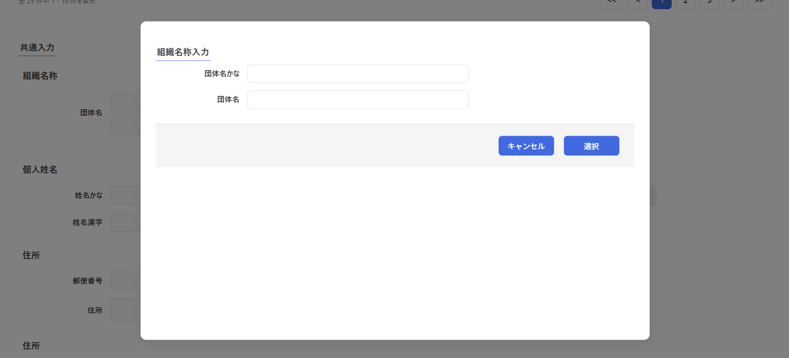

# コンポーネント設計書: InputOrgName.vue

## 1. 概要

- 組織名称（団体名、団体名かな）を入力・編集するためのフォーム入力モーダルコンポーネントです。
- 親コンポーネントから渡された初期値を `toRaw` および `structuredClone` を用いてディープコピーした内部状態で管理し、直接 Props を書き換えない安全なバインディングを実現しています。
- ユーザーによる「選択（保存）」または「キャンセル」の指示を、Emits 経由で親コンポーネントへ通知します。

## 2. 依存子コンポーネント

- なし

## 3. 画面レイアウトイメージ

## 4. インターフェース仕様

### Props

| プロパティ名 |            型             | 必須  |                       説明                       |
| :----------- | :------------------------ | :---: | :----------------------------------------------- |
| `editDto`    | `InputOrgNameDtoInterface` |  Yes  | 親コンポーネントから渡される初期値オブジェクト。 |

### Emits

|         イベント名         |                 引数                 |                          説明                          |
| :------------------------- | :----------------------------------- | :----------------------------------------------------- |
| `sendCancelInputOrgName`   | なし                                 | 編集をキャンセルし、モーダルを閉じるよう親に通知する。 |
| `sendInputOrgNameInterface`| `sendDto: InputOrgNameDtoInterface`  | 編集結果を親コンポーネントに送信する。                 |

## 5. データ構造 (DTO)

コンポーネント間のデータ受け渡しには `InputOrgNameDtoInterface` を使用します。

### `InputOrgNameDtoInterface` 仕様

| プロパティ名  |    型    | 桁数 |       説明       |
| :------------ | :------- | :--: | :--------------- |
| `orgNameKana` | `string` | 100  | 団体名かな       |
| `orgName`     | `string` | 100  | 団体名           |

## 6. 処理ロジック (ライフサイクル & イベントハンドラ)

### 6.1 初期化処理

- `props.editDto` から `toRaw` および `structuredClone` を利用して内部管理用状態 `inputOrgNameDto`（`Ref<InputOrgNameDtoInterface>`）を初期化します。

### 6.2 `onSave()`

- **契機**：「選択」ボタン押下時
- **処理内容**：
  1. `sendInputOrgNameInterface` イベントを発火し、引数に内部管理用の `inputOrgNameDto.value` を渡して親コンポーネントに送信します。

### 6.3 `onCancel()`

- **契機**：「キャンセル」ボタン押下時
- **処理内容**：
  1. `sendCancelInputOrgName` イベントを発火して親コンポーネントに通知します。
