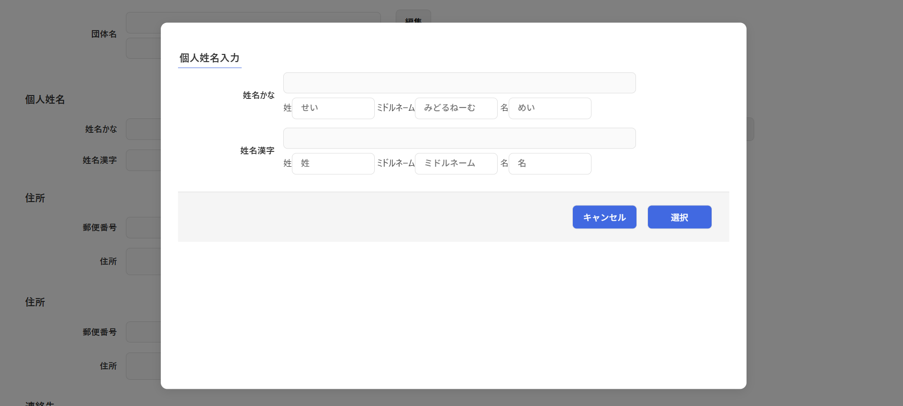

# コンポーネント設計書: InputPersonName.vue

## 1. 概要

- 個人姓名（漢字・かな）の「姓」「ミドルネーム」「名」をそれぞれ個別に入力するフォームです。
- 各入力項目（姓・名：最大40文字、ミドルネーム：最大20文字）には、対応するデータベース（`riyousha_person_property`）の桁数設定に合わせた入力文字数制限（`maxlength`）が設定されています。
- 親コンポーネントから渡された初期値を structuredClone を用いてディープコピーした内部状態で管理し、直接 Props を編集しない安全なデータバインディングを実現しています。
- 入力された値はリアルタイムに全角スペース区切りで結合され、プレビュー表示されます。

## 2. 依存子コンポーネント

- なし

## 3. 画面レイアウトイメージ

## 3. インターフェース仕様

### Props

| プロパティ名 |              型               | 必須  |                       説明                       |
| :----------- | :---------------------------- | :---: | :----------------------------------------------- |
| `editDto`    | `InputPersonNameDtoInterface` |  Yes  | 親コンポーネントから渡される初期値オブジェクト。 |

### Emits

|           イベント名           |                  引数                  |                          説明                          |
| :----------------------------- | :------------------------------------- | :----------------------------------------------------- |
| `sendCancelInputPersonName`    | なし                                   | 編集をキャンセルし、モーダルを閉じるよう親に通知する。 |
| `sendInputPersonNameInterface` | `sendDto: InputPersonNameDtoInterface` | 編集結果を親コンポーネントに送信する。                 |

## 4. データ構造 (DTO)

コンポーネント間のデータ受け渡しには `InputPersonNameDtoInterface` を使用します。

### `InputPersonNameDtoInterface` 仕様

|   プロパティ名   |    型    | 桁数  |                    説明                    |
| :--------------- | :------- | :---: | :----------------------------------------- |
| `lastName`       | `string` |  40   | 姓名の姓（漢字）                           |
| `firstName`      | `string` |  40   | 姓名の名（漢字）                           |
| `middleName`     | `string` |  20   | 姓名のミドルネーム（漢字）                 |
| `allName`        | `string` |   -   | 結合された姓名（漢字、全角スペース区切り） |
| `lastNameKana`   | `string` |  40   | 姓名の姓かな                               |
| `firstNameKana`  | `string` |  40   | 姓名の名かな                               |
| `middleNameKana` | `string` |  20   | 姓名のミドルネームかな                     |
| `allNameKana`    | `string` |   -   | 結合された姓名かな（全角スペース区切り）   |

## 6. 処理ロジック (イベントハンドラ)

### 6.1 `onSave()`

- **契機**：「選択」ボタン押下時
- **処理内容**：
  1. 算出プロパティ `allKanji` の結合結果を `inputPersonNameDto.value.allName` に代入する。
  2. 算出プロパティ `allKana` の結合結果を `inputPersonNameDto.value.allNameKana` に代入する。
  3. `sendInputPersonNameInterface` イベントを発火し、引数に編集済みの `inputPersonNameDto.value` を渡して親コンポーネントに送信する。

### 6.2 `onCancel()`

- **契機**：「キャンセル」ボタン押下時
- **処理内容**：
  1. `sendCancelInputPersonName` イベントを発火して親コンポーネントに通知する。

### 6.3 算出プロパティ `allKanji`

- **契機**：「姓」「名」「ミドルネーム」入力時
- **処理内容**：
  1. `allKanji`を　`姓＋全角スペース＋ミドルネーム＋名` と編集

### 6.4 算出プロパティ `allKana`

- **契機**：「姓かな」「名かな」「ミドルネームかな」入力時
- **処理内容**：
  1. `allKana`を　`姓かな＋全角スペース＋ミドルネームかな＋名かな` と編集
