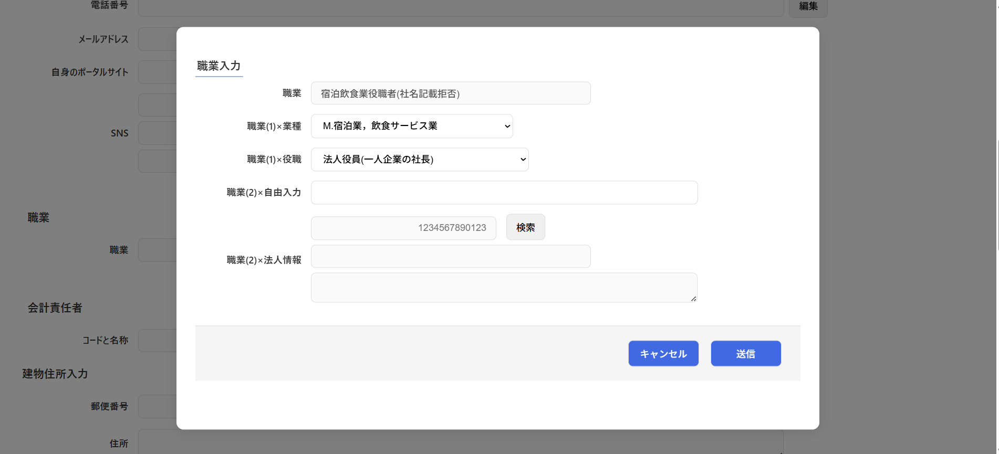

# コンポーネント設計書: InputShokugyou.vue

> [!WARNING]
> このコンポーネントでは国税庁法人番号システム Web-APIで使用するAPIキーが必須となります。コンポーネント利用をする場合は各自取得をお願いいたします。

## 1. 概要

- ユーザーの職業情報を、「業種」「役職」「自由入力」「法人（企業・団体）情報」の複数要素に細分化して入力し、それらを論理的に結合した「職業(全表記)」文字列をリアルタイムに自動生成する入力フォームコンポーネントです。
- 役職として「法人役員」が選択された場合のみ、追加情報として「法人情報（法人番号、法人名、法人所在地）」の入力エリアが動的に出現します。
- 法人情報の入力においては、親から受け渡されるAPIキーを用いて、外部APIなどから法人を検索・特定する子コンポーネント `SearchHoujinNo.vue` をモーダル表示する機能を持ちます。
- モーダル表示が2重（View側モーダル＋当コンポーネントの法人検索モーダル）になる可能性があるため、背面制御用のレイヤー定義（レイヤー2用）が適用されています。

## 2. 依存子コンポーネント

本コンポーネントは、法人役員選択時の法人検索用として、下記の子コンポーネントと依存関係を持ちます。

| コンポーネントファイル名 |                                    役割                                     |         備考          |
| :----------------------- | :-------------------------------------------------------------------------- | :-------------------- |
| `SearchHoujinNo.vue`     | 法人番号、法人名称、法人住所の検索を行い、選択された法人DTOを返却する画面。 | レイヤー2モーダル表示 |

## 3. 画面レイアウトイメージ

※ 役職が「法人役員」の時にのみ「職業(2)×法人情報」のパネルが出現します。
※ 「検索」ボタン押下時は、背面を半透明ブラックアウト（`overBackgroundLayer2`）させ、前面に法人検索画面（`overComponentLayer2`）を重ねてオーバーレイ表示します。

## 4. インターフェース仕様

### Props

|  プロパティ名  |              型              | 必須  |                             説明                              |
| :------------- | :--------------------------- | :---: | :------------------------------------------------------------ |
| `editDto`      | `InputShokugyouDtoInterface` |  Yes  | 親コンポーネントから渡される初期職業データオブジェクト。      |
| `houjinApiKey` | `string`                     |  Yes  | 法人番号検索（`SearchHoujinNo.vue`）で使用するAPIキー文字列。 |

### Emits

|          イベント名           |                 引数                  |                          説明                          |
| :---------------------------- | :------------------------------------ | :----------------------------------------------------- |
| `sendCancelInputShokugyou`    | なし                                  | 編集をキャンセルし、モーダルを閉じるよう親に通知する。 |
| `sendInputShokugyouInterface` | `sendDto: InputShokugyouDtoInterface` | 生成・決定した職業情報を親コンポーネントに送信する。   |

## 5. データ構造 (DTO)

### `InputShokugyouDtoInterface` 仕様

|     プロパティ名     |    型    |  桁数  |                                説明                                |
| :------------------- | :------- | :----: | :----------------------------------------------------------------- |
| `allShokugyou`       | `string` | 制限無 | 自動生成された職業全表記（最終的にバインドされ送信される文字列）   |
| `gyoushu`            | `string` |   -    | 選択された業種（例：「情報通信」「建設」など）                     |
| `yakushoku`          | `string` |   -    | 選択された役職（「所属なし」「一般職員」「法人役員」「定職なし」） |
| `shokugyouUserWrite` | `string` |  100   | ユーザーが直接テキスト入力した自由記述値                           |
| `houjinNo`           | `string` |   13   | 決定した企業の法人番号（13桁）                                     |
| `houjinAddress`      | `string` | 制限無 | 決定した企業の法人所在地（都道府県名＋市区町村名）                 |
| `houjinName`         | `string` |   40   | 決定した企業の法人名                                               |

## 6. 処理ロジック (ライフサイクル & イベントハンドラ)

### 6.1 `sendAllShokugyou()`

- **契機**：業種変更（`change`）、役職変更（`change`）、または自由入力へのテキスト入力（`input`）時、及び法人検索からのデータ受信時
- **処理内容**：
  - 現在選択されている役職（`inputShokugyouDto.value.yakushoku`）の値に応じて、以下の優先順位・結合ルールに基づき、最終職業表記 `allShokugyou` を自動生成してバインドします。

#### 【役職ごとの生成ルール】

|   役職区分 (コード定義値)   | 自由入力（`shokugyouUserWrite`）の状態 |    生成される `allShokugyou` のフォーマット     |
| :-------------------------- | :------------------------------------- | :---------------------------------------------- |
| **所属なし** (`"所属なし"`) | 空文字（未入力）                       | `[gyoushu]業従事者`                             |
|                             | 入力あり                               | `[shokugyouUserWrite]`                          |
| **一般職員** (`"一般職員"`) | 空文字（未入力）                       | `[gyoushu]業社員・職員`                         |
|                             | 入力あり                               | `[shokugyouUserWrite]`                          |
| **法人役員** (`"役職者"`)   | 入力あり                               | `[shokugyouUserWrite]`                          |
|                             | 空文字 ＆ 法人番号が空                 | `[gyoushu]業役職者(社名記載拒否)`               |
|                             | 空文字 ＆ 法人番号あり                 | `[gyoushu]業:[houjinName]([houjinAddress])役員` |
| **定職なし** (`"定職なし"`) | 状態問わず                             | `[shokugyouUserWrite]`                          |

### 6.2 `onSearchCorpNo()`

- **契機**：役職が「法人役員」の時に出現する「検索」ボタン押下時
- **処理内容**：
  - `isHoujinSearch.value` を `true` に設定し、背面レイヤーを重ねた上で、子コンポーネントである法人検索モーダル（`SearchHoujinNo.vue`）を最前面に表示します。

### 6.3 `recieveCorpNoInterface(sendDto)`

- **契機**：子コンポーネント（`SearchHoujinNo.vue`）からの `send-houjin-no-interface` イベント検知時
- **引数**：`sendDto: HoujinNoDtoInterface`（選択された法人情報）
- **処理内容**：
  1. 取得した法人情報を DTO にバインドします。
     - `houjinNo` ← `sendDto.houjinNo`
     - `houjinAddress` ← `sendDto.prefectureName` ＋ `sendDto.cityName`
     - `houjinName` ← `sendDto.houjinName`
  2. 新たな法人情報に基づいて、最終表記を更新するために `sendAllShokugyou()` を自動実行します。
  3. `isHoujinSearch.value` を `false` に設定して、法人検索モーダルを閉じます。

### 6.4 `recieveCancelCorpNo()`

- **契機**：子コンポーネント（`SearchHoujinNo`）からのキャンセルイベント（`send-cancel-houjin-no`）検知時
- **処理内容**：
  - `isHoujinSearch.value` を `false` に変更し、変更を行わずに法人検索モーダルのみを閉じます。

### 6.5 `onSave()`

- **契機**：「送信」ボタン押下時
- **処理内容**：
  - `sendInputShokugyouInterface` イベントを発火し、引数に `inputShokugyouDto.value` を渡して親に保存・決定を通知します。

### 6.6 `onCancel()`

- **契機**：「キャンセル」ボタン押下時
- **処理内容**：
  - `sendCancelInputShokugyou` イベントを発火し、変更を破棄してモーダルを閉じるよう親に通知します。
