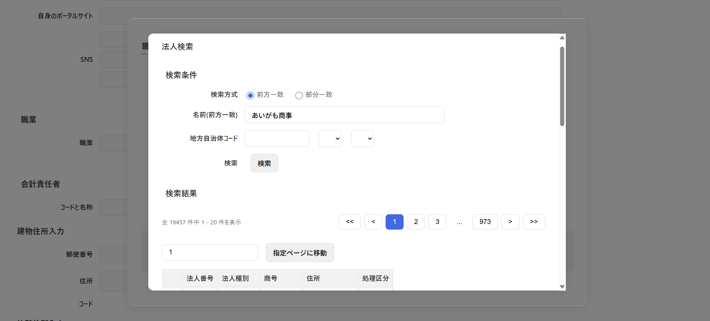
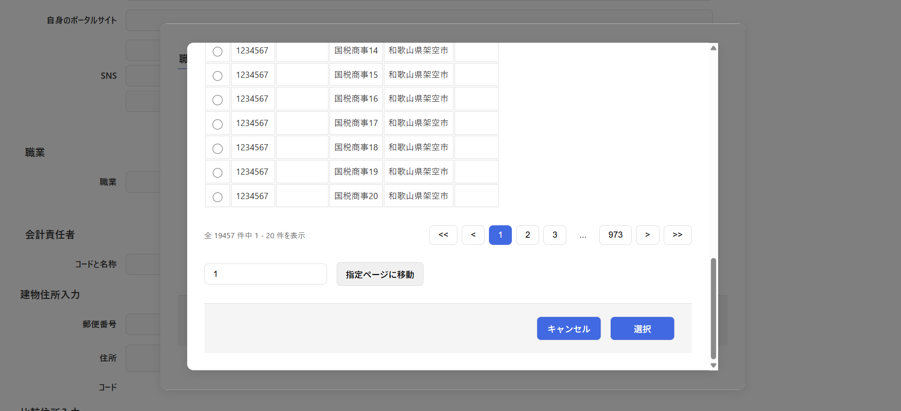

# コンポーネント設計書: SearchHoujinNo.vue

> [!WARNING]
> このコンポーネントでは国税庁法人番号システム Web-APIで使用するAPIキーが必須となります。大変お手数をおかけいたしまして申し訳ございませんが、コンポーネント利用をする場合は取得をお願いいたします。(自分が取得したキーをこの共通ツールのpackした.tgzに埋め込むのは、解凍され想定外の範囲で他者にキーを使わせる不正利用にあたると想定されるため)
>
> - 登録に必要な情報は <https://www.invoice-kohyo.nta.go.jp/web-api/index.html#cmsprereg> より取得をお願いします。
> - APIキー発行日が決まっており、その日時に一括で発行処理を行っているようなので、交付までに最大1か月半程度かかるようです(自分は約3週間でした)

## 1. 概要

- 国税庁の法人番号システムWeb-APIに接続する（バックエンド `/houjin-no/get-external` 経由）を利用し、法人名（前方一致、必須）および地方自治体コード（JIS/LGコード、任意）に基づいて法人の検索・特定、および法人番号等（法人番号、商号、本店所在地など）を取得・選択するためのモーダルダイアログコンポーネントです。
- 法人番号取得用API接続の詳細は、[使用API設計書: houjin-no/get-external](../../use_api/houjinNoGetExternal.md) を参照してください。
- 地方自治体コード（JISコード）の入力および絞り込みを行うため、子コンポーネントとして `InputLgcode.vue` が埋め込まれています。
- ページング制御（`PagingControl.vue`）に対応しており、外部APIが提供する一括最大2,000件のデータをメモリ上にキャッシュして読み込み、画面上では1ページ20件（`limit = 20`）ずつ切り出して高速にページング表示（スライス表示）する最適化ロジックを備えています。
- メモリ上の2,000件のデータ範囲を超えるページ（2,001件目以降）がリクエストされた場合は、外部APIに次の分割番号（`divide`）をセットして再度非同期クエリを送信し、2,000件単位で再読み込み（データ同期）を行います。
- 検索条件（法人名、地方自治体コード）が手入力で変更された場合はフラグ `isConditionChange` を `true` に切り替え、次回のアクション時（「検索」押下時、または「ページ移動」時）に1ページ目（`divide = 1`）から強制的に初期化・再検索されるよう安全制御されます。

## 2. 依存子コンポーネント

本コンポーネントは、検索条件の入力と結果の表示において、下記の子コンポーネントを使用します。

| コンポーネントファイル名 |                                                   役割                                                    |                                         備考                                          |
| :----------------------- | :-------------------------------------------------------------------------------------------------------- | :------------------------------------------------------------------------------------ |
| `InputLgcode.vue`        | 5桁の地方公共団体コード（JISコード/LGコード）を直接入力、またはドロップダウンメニュー連動で取得する画面。 | `is-digit5="true"`5桁に制御(法人番号検索APIが地方自治体コードを5桁に指定しているため) |
| `PagingControl.vue`      | 全ヒット件数と1ページ表示件数に基づいて、ページャーボタンを描画・制御する画面。                           |                                                                                       |
| `MessageView.vue`        | バリデーションエラー、0件ヒット、または例外/システムエラー時のメッセージ表示用。                          |                                                                                       |

## 3. 画面レイアウトイメージ

※ 本コンポーネントは2重モーダル（レイヤー2）として、親ダイアログ（`InputShokugyou.vue` 等）の最前面に配置されます。

## 4. インターフェース仕様

### Props

|  プロパティ名  |    型    | 必須  |                                         説明                                          |
| :------------- | :------- | :---: | :------------------------------------------------------------------------------------ |
| `houjinApiKey` | `string` |  Yes  | 国税庁法人番号システムに接続するための外部APIキー文字列（リクエストカプセルに封入）。 |

### Emits

|       イベント名        |                引数                 |                          説明                          |
| :---------------------- | :---------------------------------- | :----------------------------------------------------- |
| `sendCancelHoujinNo`    | なし                                | 検索をキャンセルし、モーダルを閉じるよう親に通知する。 |
| `sendHoujinNoInterface` | `selectedDto: HoujinNoDtoInterface` | 決定・選択した法人情報オブジェクトを親に送信する。     |

## 5. データ構造 (DTO)

### 5.1 `SearchHoujinNoCapsuleDtoInterface` 仕様 (リクエスト)

| プロパティ名 |    型    |                             説明                             |
| :----------- | :------- | :----------------------------------------------------------- |
| `appId`      | `string` | APIキー（国税庁API用のキー等）                               |
| `type`       | `string` | レスポンス形式（"02": Unicode-CSV）                          |
| `name`       | `string` | 画面入力の法人名（前方一致）                                 |
| `mode`       | `string` | 画面入力の検索モード（"1": 前方一致または"1": 部分一致検索） |
| `address`    | `string` | 画面選択の地方自治体コード（5桁）                            |
| `close`      | `string` | 閉鎖登記を含めるか（"1": 含める）                            |
| `divide`     | `number` | 外部API側の2000件分割番号（1〜）                             |

### 5.2 `HoujinNoDtoInterface` 仕様 (法人情報)

|   プロパティ名   |    型    |                      説明                       |
| :--------------- | :------- | :---------------------------------------------- |
| `houjinNo`       | `string` | 法人番号（13桁）                                |
| `kind`           | `string` | 法人種別コード（"101", "201", "301", "401" 等） |
| `houjinName`     | `string` | 商号・法人名称                                  |
| `prefectureName` | `string` | 都道府県名                                      |
| `cityName`       | `string` | 市区町村名                                      |
| `process`        | `string` | 処理区分コード                                  |

## 6. 処理ロジック (ライフサイクル & イベントハンドラ)

### 6.1 `onSearch()`

- **契機**：「検索」ボタン押下時、または2,000件を超える範囲へのページ移動時
- **処理内容**：
  1. **バリデーション**：
     - `capsuleDto.value.name` が未指定（`null`、`undefined`、又は空文字）である場合：
       - JISコード絞り込みなどで下部にスクロールされている場合を考慮し、最上部タイトル要素（`#target-element`）へ `scrollIntoView` でスムーズにスクロールバックします。
       - 警告メッセージ「検索条件法人名称を指定してください」を表示し、処理を中断します。
  2. **条件変更の初期化判定**：
     - 条件変更フラグ `isConditionChange.value` / `true` の場合、検索の開始位置を最初（1番目）に戻すため `capsuleDto.value.divide = 1` に初期設定します。
  3. **APIアクセス**：
     - [トークン取得共通関数: getAuthorizedPromiseArea()](../../use_api/getAuthorizedPromiseArea.md) を呼び出して認証トークンを取得します。
     - 成功時、バックエンドAPI [国税庁法人番号システム Web-API 連携 API](../../use_api/houjinNoGetExternal.md) に対し HTTP POST でリクエストオブジェクト（`capsuleDto`）を送信します。
     - レスポンス（`SearchHoujinNoResultDtoInterface`）を受け取り、総ヒット数 `allCount.value` にバインドします。
  4. **検索結果の反映（ページスライス）**：
     - 総ヒット数が `0` の場合：「検索結果が0件でした」とトーストメッセージを表示し終了。
     - ヒット数が `1` 以上の場合：
       - 20件の表示切り出し（スライス）を開始するため、開始位置（`getStartCount()`）および終了位置（`getSliceCount()`）を算出します。
       - 取得した法人リスト `houjinNoList` から算出した範囲を切り出して、表示用リスト `houjinListView.value` に反映（`splice` & `push`）します。
       - 実行後、条件変更フラグ `isConditionChange.value` を `false` に戻します。

### 6.2 `recievePagingNumber(selectedNumber)`

- **契機**：ページングコントロール（`PagingControl.vue`）でのページ切り替え時、または直接ページ移動ボタン押下時
- **引数**：`selectedNumber: number` (選択された0始まりのページインデックス)
- **処理内容**：
  1. **限界チェック**：
     - 要求されたページの最大件数（`SEARCH_LIMIT * selectedNumber`）が、全ヒット数 `allCount` を超えている場合は、タイトルへスクロールバックして警告（最大ページを超えている旨）を表示し、処理を中断します。
  2. **変更後即時リロード**：
     - 検索条件（法人名やJISコード）が変更された状態（`isConditionChange.value === true`）である場合は、要求されたページングを一旦破棄し、ページインデックスを `0`（1ページ目）に初期化した上で `onSearch()` を再実行します。
  3. **キャッシュ範囲内（2000件以内）のメモリページング（高速処理）**：
     - 要求されたページの末尾件数（`pointCount = limit * selectedNumber`）が、現在メモリにロードされている外部APIのキャッシュ限界（`divideNumber * 2000`）以下である場合：
       - 新たなAPIリクエストは一切行わず、JavaScript のメモリ内スライス `slice(startCount, startCount + 20)` で該当する20件を瞬時に切り出し、`houjinListView.value` を更新します。
  4. **キャッシュ範囲外（2000件超）の外部API再クエリ**：
     - メモリ上の2000件データ外である場合：
       - 要求するデータ範囲に該当する外部API分割番号（`divide = Math.floor(pointCount / 2000) + 1`）を計算して `capsuleDto.value.divide` に設定。
       - 外部APIより次の2,000件を取得するため、[国税庁法人番号システム Web-API 連携 API](../../use_api/houjinNoGetExternal.md) を非同期再実行します。

### 6.3 `recieveLgCode5(optionDto)` / `onNameChange()`

- **契機**：子コンポーネント `InputLgcode` での地方自治体コード変更時、または法人名称入力欄のテキスト変更（`change`）時
- **処理内容**：
  - 条件変更フラグ `isConditionChange.value` を `true` に設定します。
  - 次回のページ切り替えや検索時に、1ページ目から強制リロードするための契機とします。

### 6.4 `onSave()`

- **契機**：「選択」ボタン押下時
- **処理内容**：
  1. 現在表示中の20件の法人リストから、ラジオボタンで選択された法人番号（`selectedRow.value`）に対応する法人情報オブジェクト（`selectedDto`）をフィルタリング抽出します。
  2. 抽出された `selectedDto` を引数に添え、親コンポーネントに対し `sendHoujinNoInterface` イベントを発火してモーダルを閉じます。

### 6.5 `onCancel()`

- **契機**：「キャンセル」ボタン押下時
- **処理内容**：
  - `sendCancelHoujinNo` イベントを親コンポーネントに発火します。
