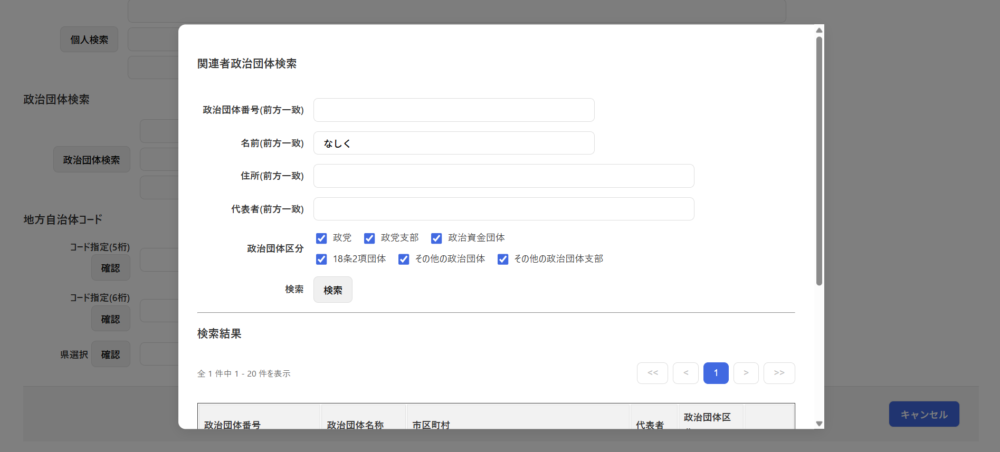
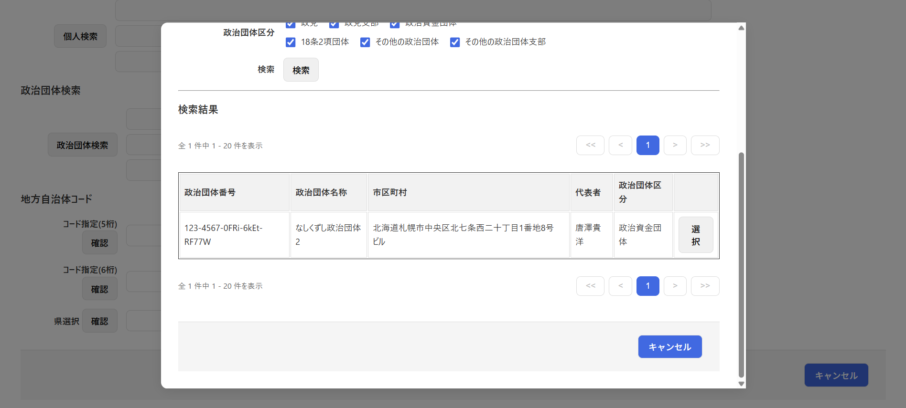

# コンポーネント設計書: SearchKanrenshaSeijidantai.vue

## 1. 概要

- 関連者（政治団体）マスタを各種条件から前方一致検索し、一覧から特定のデータを選択するための検索コンポーネントです。
- 前方一致検索条件として「政治団体番号」「名前」「住所」「代表者」の入力フォームを提供します。
- さらに政治団体を分類する「政治団体区分」の複数選択チェックボックス（政党、政党の支部、政治資金団体、資金管理団体、その他の政治団体、その他の政治団体の支部）を備えており、選択された区分に基づきフィルタリングされた検索が可能です。
- 検索実行時、セッション管理されたJWT認証トークンを安全に取得し、バックエンドAPIへ `POST` リクエストを行います。詳細なAPI仕様は、[使用API設計書: user-kanrensha/search-seijidantai](../../use_api/searchSeijidantai.md) を参照してください。
- 検索結果の一覧は、グリッド（テーブル）形式で出力し、自作の `PagingControl` コンポーネントにより1ページあたり20件の標準的なページング操作に対応しています。
- 一覧の行から「選択」が指示された場合、対応する政治団体エンティティ（マスタレコード）を Emits を経由して親コンポーネントに送信します。

## 2. 依存子コンポーネント

- `PagingControl.vue`（ページング制御用）
- `MessageView.vue`（各種メッセージ、アラート表示用）

## 3. 画面レイアウトイメージ

## 4. インターフェース仕様

### Props

|    プロパティ名    |    型     | 必須  |                            説明                            |
| :----------------- | :-------- | :---: | :--------------------------------------------------------- |
| `isRaiseCommponet` | `boolean` |  Yes  | コンポーネント単体（フッターのキャンセル表示等）の制御用。 |

### Emits

|         イベント名         |                            引数                             |                          説明                          |
| :------------------------- | :---------------------------------------------------------- | :----------------------------------------------------- |
| `sendSeijidantaiInterface` | `selectedEntity: KanrenshaSeijidantaiMasterEntityInterface` | グリッドで選択された政治団体エンティティデータを送信。 |
| `sendCancelSeijidantai`    | なし                                                        | 検索を終了し、コンポーネントを閉じる指示を親に通知。   |

## 5. データ構造 (DTO)

コンポーネント内外の検索および結果処理で以下の DTO および Entity インターフェースを使用します。

### `SearchKanrenshaSeijidantaiCapsuleDtoInterface` 仕様

※ `FrameworkPagingDtoInterface` のプロパティを継承します。

|  プロパティ名   |     型     |  桁数  |                  説明                   |
| :-------------- | :--------- | :----: | :-------------------------------------- |
| `poliOrgNo`     | `string`   | 制限無 | 政治団体番号（前方一致）                |
| `name`          | `string`   | 制限無 | 名前（前方一致）                        |
| `address`       | `string`   | 制限無 | 住所（前方一致）                        |
| `delegate`      | `string`   | 制限無 | 代表者（前方一致）                      |
| `listDantaiKbn` | `string[]` |   -    | 政治団体区分コードのリスト（複数選択）  |
| `allCount`      | `number`   |   -    | 総件数（ページング共通）                |
| `limit`         | `number`   |   -    | 1ページあたりの件数（ページング共通）   |
| `pageNumber`    | `number`   |   -    | 現在のページ番号（ページング共通、0〜） |

### `SearchKanrenshaSeijidantaiResultDtoInterface` 仕様

※ `FrameworkPagingDtoInterface` のプロパティを継承します。

|      プロパティ名       |                      型                       |                説明                |
| :---------------------- | :-------------------------------------------- | :--------------------------------- |
| `listMasterSeijidantai` | `KanrenshaSeijidantaiMasterEntityInterface[]` | 関連者政治団体マスタ検索結果リスト |
| `allCount`              | `number`                                      | 総件数                             |
| `limit`                 | `number`                                      | 1ページあたりの件数                |
| `pageNumber`            | `number`                                      | 現在のページ番号                   |

### `KanrenshaSeijidantaiMasterEntityInterface` 仕様

|          プロパティ名          |    型    |                      説明                      |
| :----------------------------- | :------- | :--------------------------------------------- |
| `kanrenshaSeijidantaiMasterId` | `number` | テーブル主キーId                               |
| `seijidantaiKanrenshaCode`     | `string` | 政治団体関連者コード                           |
| `poliOrgNo`                    | `string` | 政治団体番号                                   |
| `kanrenshaName`                | `string` | 企業・団体名                                   |
| `allAddress`                   | `string` | 企業・団体全住所                               |
| `seijidantaiDelegate`          | `string` | 企業・団体代表者                               |
| `dantaiKbn`                    | `string` | 政治団体区分（1:政党、2:政党支部 等）          |
| `compareNameText`              | `string` | 名称比較用（正規化、半角カナ変換等のテキスト） |

### `SeijidantaiDantaiKbnConstants` 仕様（政治団体区分コードマッピング）

|   定数プロパティ名    | コード値 |  画面表示名 (ラベル)   |
| :-------------------- | :------: | :--------------------- |
| `SEITOU`              |  `"1"`   | 政党                   |
| `SEITOU_SHIBU`        |  `"2"`   | 政党の支部             |
| `SEIJI_SHIKIN_DANTAI` |  `"3"`   | 政治資金団体           |
| `DANTAI_18JOU_2KOU`   |  `"4"`   | 資金管理団体（※）      |
| `SONOTA`              |  `"5"`   | その他の政治団体       |
| `SONOTA_SHIBU`        |  `"6"`   | その他の政治団体の支部 |

※ 正式名称: 「法第18条の2第1項の規定による団体」

## 6. 処理ロジック (ライフサイクル & イベントハンドラ)

### 6.1 `onSearch()`

- **契機**：「検索」ボタン押下時
- **処理内容**：
  1. ページング制御用リアクティブ変数（`allCount`, `limit`, `pageNumber`）を、リクエスト用 `capsuleDto.value` にセットします。
  2. `capsuleDto.value.listDantaiKbn` をクリア（`splice(0)`）します。
  3. 各区分チェックボックス（`isKbnSeitou`, `isKbnSeitouShibu` 等）の選択状態（`true`）に応じて、対応する区分コード（`SeijidantaiDantaiKbnConstants.XXX`）を `capsuleDto.value.listDantaiKbn` 配列へ追加（`push`）します。
  4. [トークン取得共通関数: getAuthorizedPromiseArea()](../../use_api/getAuthorizedPromiseArea.md) を呼び出して認証トークンを取得します。
     - **トークン取得成功時**：
       - バックエンドの [使用API設計書: user-kanrensha/search-seijidantai](../../use_api/searchSeijidantai.md) に対して `POST` リクエストを送信します。
         - メソッド：`POST`
         - ボディ：`JSON.stringify(capsuleDto.value)`
         - ヘッダー：
           - `Accept: 'application/json'`
           - `Content-Type: 'application/json'`
           - `X-AUTH-TOKEN: 'Bearer ' + token`
       - **API接続成功時 (200 OK等)**：
         - レスポンスのJSONデータを `resultDto.value`（`SearchKanrenshaSeijidantaiResultDtoInterface`）に代入します。
         - 取得したマスタレコードリスト（`resultDto.value.listMasterSeijidantai`）の長さが `0`（件数ゼロ）の場合：
           - メッセージ表示情報を設定：エラーレベル（`MessageConstants.LEVEL_INFO`）、表示タイプ（`MessageConstants.VIEW_TOAST`、トースト表示）、タイトル（「タスク情報検索」）、メッセージ（「検索結果が0件でした」）を設定します。
         - レスポンス内のページングパラメータを反映し、ローカル状態（`allCount`, `limit`, `pageNumber`）を更新します。
       - **API接続エラー時 (catch)**：
         - メッセージ表示情報を設定：エラーレベル（`MessageConstants.LEVEL_ERROR`）、表示タイプ（`MessageConstants.VIEW_OK`）、タイトル（「タスク情報検索」）、メッセージ（「システムエラーが発生しました。システム管理者にお問い合わせください」）を設定します。
     - **トークン取得失敗時**：
       - 共通関数よりスローされる各種エラー（`AccessTokenNotFoundError`、`TokenRefreshError`、その他エラー）に応じたエラーメッセージを表示します。詳細なエラー仕様は [トークン取得共通関数: getAuthorizedPromiseArea()](../../use_api/getAuthorizedPromiseArea.md) を参照。

### 6.2 `onSelectRow(selectedNo)`

- **契機**：検索結果一覧グリッド内、各行の「選択」ボタン押下時
- **引数**：`selectedNo: number`（選択されたレコードの `kanrenshaSeijidantaiMasterId`）
- **処理内容**：
  1. `resultDto.value.listMasterSeijidantai` 配列をフィルターし、主キー `kanrenshaSeijidantaiMasterId` が `selectedNo` に一致するエンティティオブジェクト（`selectedEntity`）を取得します。
  2. 該当オブジェクトが存在する場合、`sendSeijidantaiInterface` イベントを発火し、引数に `selectedEntity` を渡して親コンポーネントに通知します。

### 6.3 `onCancel()`

- **契機**：「キャンセル」ボタン押下時（`isRaiseCommponet` が有効な場合）
- **処理内容**：
  1. `sendCancelSeijidantai` イベントを発火して親コンポーネントに通知します。

### 6.4 `recievePagingNumber(selecteddNumber)`

- **契機**：ページングコントロール（`PagingControl`）から `send-paging-number` イベント受信時
- **引数**：`selecteddNumber: number`（ユーザーがクリックした選択ページ番号）
- **処理内容**：
  1. 状態変数 `pageNumber.value` を、受信した `selecteddNumber` に更新します。
  2. ページング指定条件での再検索を行います。

### 6.5 `recieveSubmit(button)`

- **契機**：メッセージ表示コントロール（`MessageView`）よりボタン応答イベント受信時
- **引数**：`button: string`
- **処理内容**：
  1. コマンドラインまたはコンソールに `button` の値をデバッグ出力します。
  2. `infoLevel.value` を `0`（`LEVEL_NONE`）、`messageType.value` を `0`（`VIEW_NONE`）に再設定してメッセージポップアップを非表示にします。
