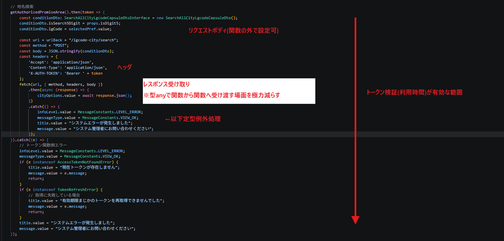

# トークン取得共通関数: getAuthorizedPromiseArea()

## 1. 概要

- アプリケーション全体で共通して使用される、API実行用の認証トークン（アクセストークン）を非同期で取得する共通関数です。
- 保存されているトークンの有効期限などを検証し、必要に応じて自動的にトークンの再取得・更新を試みます。
- APIユーザが長期トークンを基にアクセスを行う場合、最初のAPIアクセスの前に一度発行された長期トークンをユーザ情報に登録する必要があります。

## 2. 処理内容と戻り値

- **戻り値**: `Promise<string>`
- 認証トークンの取得に成功した場合、解決（resolve）されたPromiseからJWTアクセストークン文字列が返却されます。

## 3. 例外処理・エラーハンドリング

トークン取得時にエラーが発生した場合、以下の例外（Error）クラスがスローされます。

- **`AccessTokenNotFoundError`**:
  - 発生契機: 現在アクセストークンがストレージ等に存在しない場合
  - 例外メッセージ例: 「現在トークンが存在しません」
- **`TokenRefreshError`**:
  - 発生契機: トークンは存在するが有効期限が切れており、自動再取得（リフレッシュ）に失敗した場合
  - 例外メッセージ例: 「有効期限まじかのトークンを再取得できませんでした」
- **その他の例外**:
  - 発生契機: 予期しないシステム障害などが発生した場合
  - メッセージ例: 「システムエラーが発生しました」「システム管理者にお問い合わせください」

## 3. 利用例

```

    // 最初のAPIアクセスの前に当サイトから発行した長期トークンをユーザ情報にセットする
    // アクセスのたびに、ではなく最初の1回の前だけ

    // 各自の保存済有効長期トークン呼び出し処置
    const longToken:Ref<string> = getStoredLongToken();

    // トークンセット処理
    const userInfo = useUserInfoStoreCommon();
    userInfo.jwtDto.refreshToken = longToken.value;
    userInfo.jwtDto.accessToken = longToken.value;


    // APIアクセス(例：地方自治体コード市町村選択項目)
    getAuthorizedPromiseArea().then(token => {
        const conditionDto: SearchAllCityLgcodeCapsuleDtoInterface = new SearchAllCityLgcodeCapsuleDto();
        conditionDto.isSearch5Digit = props.isDigit5;
        conditionDto.lgCode = selectedPref.value;

        const url = urlBack + "/lgcode-city/search";
        const method = "POST";
        const body = JSON.stringify(conditionDto);
        const headers = {
            'Accept': 'application/json',
            'Content-Type': 'application/json',
            'X-AUTH-TOKEN': 'Bearer ' + token
        };
        fetch(url, { method, headers, body })
            .then(async (response) => {
                cityOptions.value = await response.json();
            })
            .catch(() => {
                infoLevel.value = MessageConstants.LEVEL_ERROR;
                messageType.value = MessageConstants.VIEW_OK;
                title.value = "システムエラーが発生しました";
                message.value = "システム管理者にお問い合わせください";
            });
    }).catch((e) => {
        // トークン関数側エラー
        infoLevel.value = MessageConstants.LEVEL_ERROR;
        messageType.value = MessageConstants.VIEW_OK;
        if (e instanceof AccessTokenNotFoundError) {
            title.value = "現在トークンが存在しません";
            message.value = e.message;
            return;
        }
        if (e instanceof TokenRefreshError) {
            // 取得に失敗している場合
            title.value = "有効期限まじかのトークンを再取得できませんでした";
            message.value = e.message;
            return;
        }
        title.value = "システムエラーが発生しました";
        message.value = "システム管理者にお問い合わせください";
    });

```


